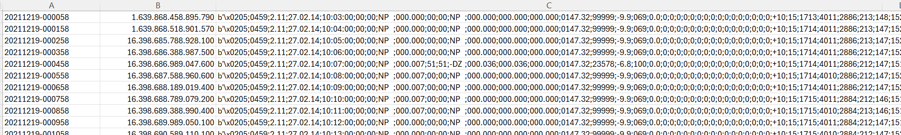
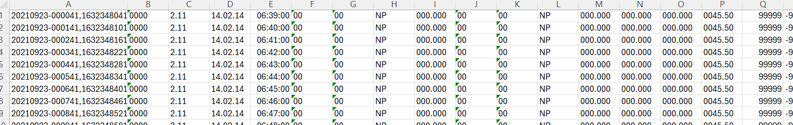
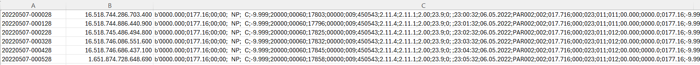
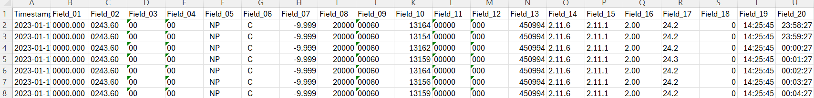

# Guide to Converting Historical Disdrometer CSVs and TXTs to NetCDFs

This file explains how to convert old CSV or TXT files to netCDF files and the difference in formats between certain files. 

## Parsing a TXT
Each TXT represents one telegram, which means a whole directory of 1440 TXT's need to be parsed to get a full day. You can use the [wget](https://linuxize.com/post/wget-command-examples/) executable to download whole directories. The command `wget -nH --cut-dirs=4 --recursive https://ruisdael.citg.tudelft.nl/parsivel/PAR001_Cabauw/2021/202101/20210130/ --no-parent` will save all files in a directory called `20210130`.  For calling the script the *site_config* file, a directory and the file type (in this case TXT) need to be specified, e.g `python3 parse_disdro_csv.py -c configs_netcdf/config_001_Cabauw.yml -i sample_data/20210130 -f txt`. The NetCDF will then be exported to the same directory the data is found, in this case `sample_data`. The sensor for TXT's is always Parsivel.

## Parsing a CSV
When parsing a CSV, one should be in the main directory of `python-logging-software` where `parse_disdro_csv.py` is located. For calling the script the *site config* file and a CSV need to be specified, e.g. `python3 parse_disdro_csv.py -c configs_netcdf/config_008_GV.yml -i sample_data/20230116_Delft-GV_PAR008.csv -f csv`. The netCDF will then be exported to the same directory as the CSV, in this case `sample_data`. The script will detect what sensor is relevant from the site config file and it also detects what format the CSV is in.

## Output 
The NetCDF will be in the format `{date}_{sensor-name}_{site-name}.nc`. It can be opened in Panoply.

## Formats for CSV

The CSVs this script can parse come in 4 different formats, 2 for Parsivel and 2 for Thies. Both formats for each respective sensor have the same difference, the values from the telegram are all saved in a byte string in a single column or each value has an own column. A matrix to illustrate in which 4 boxes a CSV format can be categorized in:
|                | Thies | Parsivel   |
|----------------|-----------------------|----------------------|
| **Bytestring** |     "Datetime"; "Timestamp"; "b'$\backslash$x02Field 01; Field 02; ...'"    | "Datetime"; "Timestamp"; "b'Field 01; Field 02; ... '" |
| **Seperate Columns**    |     "Datetime,Timestamp,Field 02"; "Field 03"; "Field ...";  | "Datetime"; "Field 01"; "Field 02"; "Field ...";   |

For the bytestring CSVs, a row has 3 values: A datetime, a Posix timestamp, and the bytestring. The datetime differs in format between Thies and Parsivel, but conveys the same information. The Field values correspond to the respective Parsivel and Thies documentation.

In the Parsivel CSVs field 61 is never documented, although it is in the config files and the Parsivel documentation. This is due to the way the Parsivels are set up, this field needs a different configuration to be requested. 

On the website where one can find these CSVs, one might find CSVs labeled SVF (single value fields). The script isn't able to parse these CSVs.

### Examples
#### Bytestring Thies

#### Seperate Columns Thies

#### Bytestring Parsivel

#### Seperate Columns Parsivel

