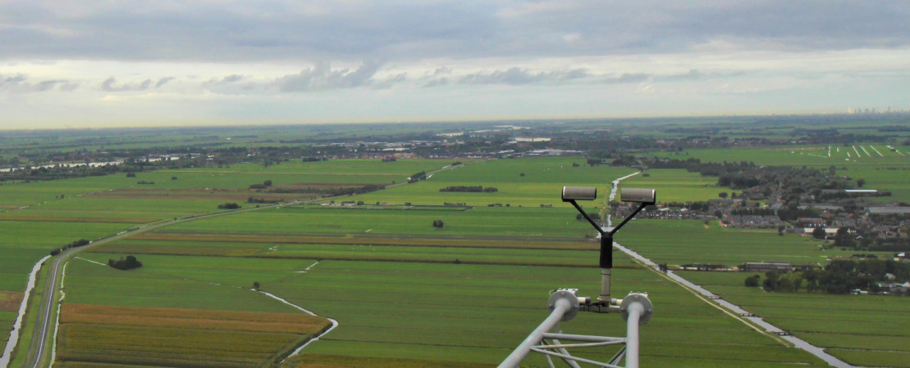
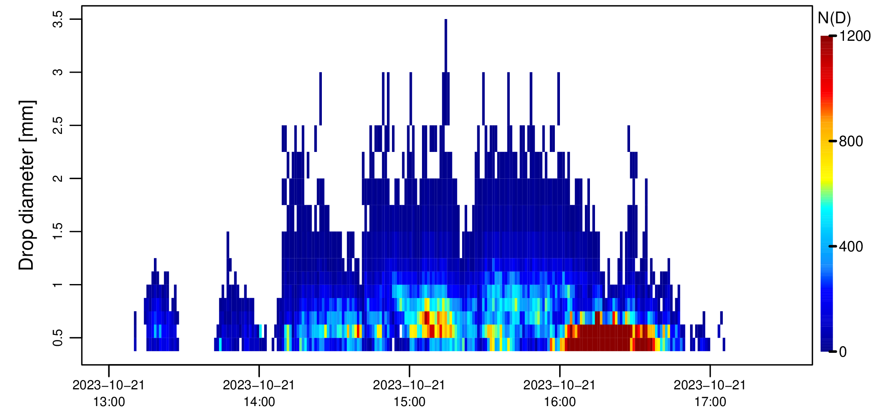

# Disdrometer data logging software - version 2

[[_TOC_]]

disdroDL is a Python software for acquiring and storing data from the OTT Parsivel2 optical disdrometer into daily NetCDF files. It was developed by TU Delft, within the framework of the Ruisdael observatory for atmospheric science. 

One of the key aspects in disdroDL is the decision to separate code logic from the NetCDF structure and metadata. During the creation of the NetCDFs, one [general yaml file](configs_netcdf/config_general_parsivel.yml) containing the description of Parsivel telegram variables and dimensions, that is applicable to all the Parsivels; is combined with site-specific metadata files that describe the variable components of the metadata such as location, name, etc.

The software features a main script ([main.py](./main.py)) for setting up a serial connection with the Parsivel, requesting data at regular time intervals, and storing the Parsivel's Telegram data in a local sqlite3 database file `disdrodl.db`. And an export script ([export_disdrodlDB2NC.py](export_disdrodlDB2NC.py)) that exports 1 day of Parsivel data, from `disdro.db` onto a NetCDF file. 

By default, all fields listed on page 29 of the [OTT Parsivel2 official documentation](https://www.ott.com/download/operating-instructions-present-weather-sensor-ott-parsivel2-with-screen-heating-1/) are requested, except for field 61 (List of all particles detected). The NetCDF files are self-descriptive, and include metadata information about dimensions, variables names and units. 

The structure of the NetCDF file depends on two configuration files, a general and site-specific one. The general configuration ([configs_netcdf/config_general_parsivel.yml](.configs_netcdf/config_general_parsivel.yml)) file is applicable to all sites and sensors, while the specific configuration files (1 file per sensor (in [configs_netcdf/](configs_netcdf/)) describe the variable components such as site names, coordinates, etc.  



_Parsivel2 disdrometer in the Cabauw tower, Netherlands. The signal attenuation caused by raindrops falling through the laser beam between the two plates can be used to estimate the size and velocity of hydrometeors._




_The Parsivel2 measures the drop number concentrations for different diameter/velocity bins, with a temporal resolution of 1 minute. These raw spectra can be used to calculate many different state and flux variables, such as liquid water content, rainfall rate, mean drop diameter, radar reflectivity and kinetic energy._


## Conventions
* Time is set to UTC 
* the data destination directory: defined in [configs_netcdf/](configs_netcdf/) site specific config files, under the `data_dir` variable 
* monthly data directories `yyyymm` are created inside parent data directory 
* every day, a new NetCDF file is created, with the following naming convention:
`yyyymmdd_{site_name}_{station_code}_{sensor_name}.nc`


## Requirements

* create a python virtual environment:
* installed python dependencies: `pip -r requirements.txt`
* create a log directory with read and write permissions to all users: `sudo mkdir /var/log/disdroDL/; sudo chmod a+rw /var/log/disdroDL` 
* create a data directory with read and write permissions to all users: `sudo mkdir /data/disdroDL/; sudo chmod a+rw /data/disdroDL` 
* run [reset_parsivel](./reset_parsivel.py): `python reset_parsivel.py` to reset the parsivel time and accumulated rain amount **(TODO:confirm)** 
* create a station-specific file and commit it to this repo (see [configs_netcdf/config_008_GV.yml](./configs_netcdf/config_008_GV.yml) as an example) 
* install netcdf-bin: `sudo apt install netcdf-bin`, to be able to compress NetCDFs

## Run scripts
**Manually**: 
* Writes Parsivel Telegrams to sqlite3 DB `python main.py --config configs_netcdf/config_008_GV.yml` (usually ran as service, but can also be run as a standalone script)

* Export DB entries of one day to a NetCDF `python export_disdrodlDB2NC.py --date 2023-12-24 --config configs_netcdf/config_008_GV.yml`


**As Linux Systemd Service**: 
* edit the config file name in [disdrodlv2.service](disdrodlv2.service) to match that of the station
* create system link between local service file and service files location: `ln disdrodlv2.service /etc/systemd/system/disdrodlv2.service`
* run: `systemctl enable disdrodlv2.service`
* run: `systemctl start disdrodlv2.service`
* check status: `systemctl status disdrodlv2.service`


## Outputs
**netCDF output**
* [sample_data/20240115_Green_Village-GV_PAR008.nc](sample_data/20240115_Green_Village-GV_PAR008.nc)

Note that some of the fields sent by the Parsivel are discarded during the creation of the NetCDF file. For example, all the 16bit fields are discarded and only the 32bit values are stored. Rainfall accumulation (field 24) is discarded because it is relative to an unknown starting time and can be re-calculated from the rain rate. Sensor time/date (fields 20-21) are replaced by the actual time (in UTC) of the computer running the logging software. This is more reliable than to use the internal clock of the Parsivel which can drift over time. Sample interval (field 9) is ignored, because it can be inferred from the time difference between successive measurements.

No quality control is applied to the output.

The NetCDF files are automatically compressed.


## Software Operational Principals

* Main script: [main.py](main.py)
* Configuration files: 
    * general: [configs_netcdf/config_general_parsivel.yml](configs_netcdf/config_general_parsivel.yml) - *should not need editing*
    * specific: e.g., [configs_netcdf/config_008_GV.yml](configs_netcdf/config_008_GV.yml) - *create 1 per Parsivel*
* Export script [export_disdrodlDB2NC.py](export_disdrodlDB2NC.py) - exports 1day of measurements from DB to NetCDF file
* Functions and classes: [modules/classes.py](modules/classes.py), [modules/util_functions.py](modules/util_functions.py)

**[main.py](main.py)** (often as service, see example [disdrodlv2.service](disdrodlv2.service))
* reads configurations from [configs_netcdf/config_general_parsivel.yml](configs_netcdf/config_general_parsivel.yml) and target-device config
* sets up the serial communication with the Parsivel 
* in a while loop (every minute):
    * requests the telegram from OTT Parsivel2, outputting all measurement values : `CS/PA<CR>` 
    * appends the received telegram data into `disdro.db`

**[export_disdrodlDB2NC.py](export_disdrodlDB2NC.py)**
* reads configurations from [configs_netcdf/config_general_parsivel.yml](configs_netcdf/config_general_parsivel.yml) and target-device config
* queries `disdro.db` for entries between 00:00:00 and 23:59:59 of the date provided to arg `--date`
* for each returned database entry:
    * the telegram (db column) value is parsed in an instance of the `Telegram`
    * instance of the `Telegram` is appended to `telegram_objs` list
* `telegram_objs` is provided to an instance of the `NetCDF` class, which
    * creates a NetCDF file
    * writes the `telegram_objs` data into the NetCDF 
    * compresses the NetCDF file using `nccopy -d9`
    
**[disdrodlv2.service](disdrodlv2.service)**  - Linux's systemd service file responsible for running [main.py](main.py) as a service
* requires editing: replace default path of config file, with config for the instrument in question.


# Auxiliary scripts
## Work in Progress [parse_disdro_csv.py](parse_disdro_csv.py) 

*Parser for historical Ruisdael's OTT Parsivel CSVs. Converts CSV to netCDF*

Run: `python parse_disdro_csv.py -c configs_netcdf/config_007_CABAUW.yml -i sample_data/20231106_PAR007_CabauwTower.csv`

# Tests
* [test_functions.py](test_functions.py)
* [test_db.py](test_db.py)
* [test_classes.py](test_classes.py)


run: `pytest -s`


# Debugging Serial communication

with 2 different screens (use tmux multiplexer or 2 different shells)

terminal one: listen to serial port `tail -f /dev/ttyUSB0`

terminal two: send commands to serial port `echo -en "CS/L\r" > /dev/ttyUSB0`


# disdrodl.db
In most cases there will not be a need to interact directly with `disdrodl.db`, yet it might be useful, in some situations.


connect: `sqlite3 disdrodl.db`

Request all column names: `sqlite> PRAGMA table_info(disdrodl);`

```sql
0|id|INTEGER|0||1
1|timestamp|REAL|0||0
2|datetime|TEXT|0||0
3|parsivel_id|TEXT|0||0
4|telegram|TEXT|0||0
```

## Select first record:
```sql 
sqlite> SELECT id, timestamp, datetime FROM disdrodl ORDER BY id LIMIT 1;
```
`1|1702630920.30165|2023-12-15T09:02:00.301653`

Note: if you want to print the values for all columns, including the `telegram` data column, simply use `SELECT *`:

```sql
SELECT * FROM disdrodl ORDER BY id LIMIT 1;
```


## Last record:
```sql 
sqlite> SELECT id, timestamp, datetime FROM disdrodl ORDER BY id DESC LIMIT 1;
```
`19966|1704194160.49732|2024-01-02T11:16:00.497322`


# Note on POSIX timestamps 

The column timestamp stores POSIX timestamps of each Parsivel's telegra

Python docs on [datetime.datetime.fromtimestamp](https://docs.python.org/3.3/library/datetime.html#datetime.datetime.fromtimestamp) states that:
> Return the local date and time corresponding to the POSIX timestamp, such as is returned by time.time(). If optional argument tz is None or not specified, the timestamp is converted to the platform’s local date and time, and the returned datetime object is naive.

Hence, to prevent naive dates (without time-zone info), the conversion of a POSIX timestamp must include the UTC as the timezone ie. `datetime.fromtimestamp(ts, tz=timezone.utc)`.

# Authors
disdroDL is developed in the context of the [Ruisdael Observatory](https://ruisdael-observatory.nl/) by

* Marc Schleiss (Principal Investigator)
* Andre Castro
* Mahaut Sourzac 
* Rob MacKenzie

# License
GPLv3. See [LICENSE](LICENSE)
