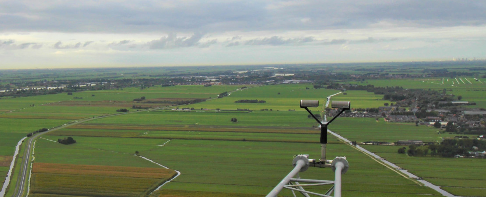
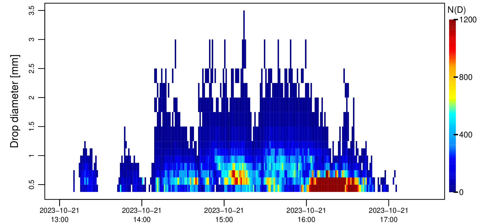

# Disdrometer data logging software - version 2

[[_TOC_]]

disdroDL is a Python software for acquiring and storing data from the OTT Parsivel2 optical disdrometer, developed by TU Delft, within the framework of the Ruisdael observatory for atmospheric science. 

The software features a main script ([main.py](./main.py)) for setting up a serial connection with the Parsivel, requesting data at regular time intervals, and storing the output in a NetCDF file.

By default, all fields listed on page 29 of the [OTT Parsivel2 official documentation](https://www.ott.com/download/operating-instructions-present-weather-sensor-ott-parsivel2-with-screen-heating-1/) are requested, except for field 61 (List of all particles detected). The NetCDF files are self-descriptive, and include metadata information about dimensions, variables names and units. 

The structure of the NetCDF file depends on two configuration files, a general and site-specific one. The general configuration ([configs_netcdf/config_general.yml](.configs_netcdf/config_general.yml)) file is applicable to all sites and sensors, while the specific configuration files (1 file per sensor (in [configs_netcdf/](configs_netcdf/)) describe the variable components such as site names, coordinates, etc.  

_Parsivel2 disdrometer in the Cabauw tower, Netherlands. The signal attenuation caused by raindrops falling through the laser beam between the two plates can be used to estimate the size and velocity of hydrometeors._

_The Parsivel2 measures the drop number concentrations for different diameter/velocity bins, with a temporal resolution of 1 minute. These raw spectra can be used to calculate many different state and flux variables, such as liquid water content, rainfall rate, mean drop diameter, radar reflectivity and kinetic energy._

## Operational Principals

* Main script: [main.py](main.py)
* Configuration files: 
    * general: [configs_netcdf/config_general.yml](configs_netcdf/config_general.yml) - *should not need editing*
    * specific: e.g., [configs_netcdf/config_008_GV.yml](configs_netcdf/config_008_GV.yml) - *create 1 per Parsivel*
* Parsivel reset script: [reset_parsivel.py](reset_parsivel.py)
* Functions and classes: [modules/classes.py](modules/classes.py), [modules/util_functions.py](modules/util_functions.py)

**[main.py](main.py)**

* reads configurations from [configs_netcdf/config_general.yml](configs_netcdf/config_general.yml) and target-device config
* creates the data and log directories 
* sets up the serial communication with the Parsivel 
* in a while loop (every minute):
    * requests the telegram from OTT Parsivel2, outputting all measurement values : `CS/PA<CR>` 
    * appends the received telegram data into a daily NetCDF file, though `class Telegram` 

**[disdrodlv2.service](disdrodlv2.service)**  - Linux's systemd service file responsible for running [main.py](main.py) as a service

## Conventions
* Time is set to UTC 
* The software produces daily NetCDF files
* the data destination parent directory is defined in [configs_netcdf/](configs_netcdf/) site specific config files, under the `data_dir` variable 
* monthly data directories `yyyymm` are created inside parent data directory 
* every day, a new NetCDF file is created, with the following naming convention:
`yyyymmdd_{site_name}_{station_code}_{sensor_name}.nc`

## Requirements

* create a python virtual environment:
* installed python dependencies: `pip -r requirements.txt`
* create a log directory with read and write permissions to all users: `sudo mkdir /var/log/disdroDL/; sudo chmod a+rw /var/log/disdroDL` 
* create a data directory with read and write permissions to all users: `sudo mkdir /data/disdroDL/; sudo chmod a+rw /data/disdroDL` 
* run [reset_parsivel](./reset_parsivel.py): `python reset_parsivel.py` to reset the parsivel time and accumulated rain amount **(TODO:confirm)** 
* create a station-specific file and commit it to this repo (see [configs_netcdf/config_008_GV.yml](./configs_netcdf/config_008_GV.yml) as an example) 
* install netcdf-bin: `sudo apt install netcdf-bin`, to be able to compress netCDFs with `nccopy -d6` in `Telegram.compress_netcdf()` method.

## Run script
**Manually**: 
* [main.py](./main.py) manually: `python main.py -c configs_netcdf/config_NNN_*.yml`

**As Linux Systemd Service**: 
* edit the config file name in [disdrodlv2.service](disdrodlv2.service) to match that of the station
* create system link between local service file and service files location: `ln disdrodlv2.service /etc/systemd/system/disdrodlv2.service`
* run: `systemctl enable disdrodlv2.service`
* run: `systemctl start disdrodlv2.service`
* check status: `systemctl status disdrodlv2.service`

## Outputs
**netCDF output**
* [sample_data/20231029_Lutjewad_Atmospheric_Station-LUTJEWAD_PAR009.nc](sample_data/20231029_Lutjewad_Atmospheric_Station-LUTJEWAD_PAR009.nc)

Note that some of the fields sent by the Parsivel are discarded during the creation of the NetCDF file. For example, all the 16bit fields are discarded and only the 32bit values are stored. Rainfall accumulation (field 24) is discarded because it is relative to an unknown starting time and can be re-calculated from the rain rate. Sensor time/date (fields 20-21) are replaced by the actual time (in UTC) of the computer running the logging software. This is more reliable than to use the internal clock of the Parsivel which can drift over time. Sample interval (field 9) is ignored, because it can be inferred from the time difference between successive measurements.

No quality control is applied to the output.

The NetCDF files are automatically compressed.

## Tests
* [test_functions.py](test_functions.py)
* [test_classes.py](test_classes.py)

run: `pytest -s`

## Debug Serial communication

with 2 different screens (use tmux multiplexer or 2 different shells)

terminal one: listen to serial port `tail -f /dev/ttyUSB0`

terminal two: send commands to serial port `echo -en "CS/L\r" > /dev/ttyUSB0`

# Authors
disdroDL is developed in the context of the [Ruisdael Observatory](https://ruisdael-observatory.nl/) by

* Marc Schleiss (Principal Investigator)
* Andre Castro
* Mahaut Sourzac 
* Rob MacKenzie

# License
GPLv3. See [LICENSE](LICENSE)
